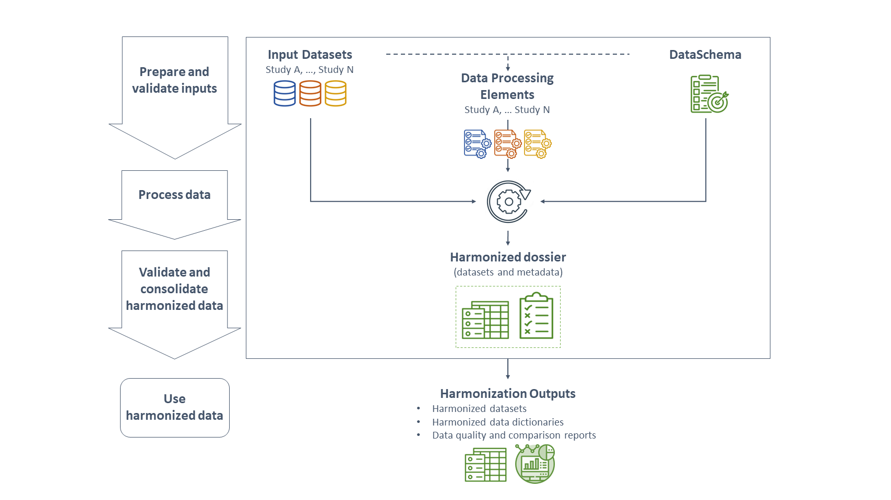

<!-- README.md is generated from README.Rmd. Please edit that file -->

# Rmonize

<!-- badges: start -->

[](https://github.com/maelstrom-research/Rmonize/actions/workflows/R-CMD-check.yaml)
<!-- badges: end -->

# Overview

Harmonizing data (processing data items from different datasets under a
common format) is essential to support research but can be
methodologically and technically challenging. Rmonize is an R package
developed by
<a href="https://www.maelstrom-research.org/" target="_blank">Maelstrom
Research</a> to address some of the key challenges faced and promote a
streamlined, reusable, and well documented harmonization pipeline. The
current documentation provides a starting point to use the package.

# Pipeline



<br>

Data processing in Rmonize depends on three external user-provided
elements: the input datasets (datasets collected by individual studies
or data collection centres), DataSchema (list of core variables to
generate across input datasets), and Data Processing Elements (elements
and algorithms needed to process variables from input datasets into
DataSchema formats). The DataSchema and Data Processing Elements are
prepared in Excel spreadsheets and imported into R, and they can be
easily modified and shared outside of R. The package includes integrated
functions to support organized data processing and generate well
documented outputs. These functions help to prepare and validate inputs,
process input datasets into harmonized datasets, identify and
troubleshoot errors in processing elements, and produce documentation to
help users evaluate harmonized data content and quality. The main
outputs provided by Rmonize are the harmonized datasets, their
associated data dictionaries, and reports with descriptive statistics,
provided in summary tables or figures. Rmonize also uses two underlying
packages, <a href="https://CRAN.R-project.org/package=madshapR" 
target="_blank">madshapR</a> and
<a href="https://CRAN.R-project.org/package=fabR" 
target="_blank">fabR</a>, which include many functions to work with data
and metadata. The specific functions required by Rmonize are
automatically loaded and accessible to the user without separately
loading madshapR and fabR.

# Installation

``` r
# To install Rmonize:
install.packages('Rmonize')

library(Rmonize)
# If you need help with the package, please use:
Rmonize_help()

# Downloadable templates are available here
Rmonize_templates()

# Demo files are available here, along with an online demonstration process 
Rmonize_DEMO
```

## Getting started

For more information, you can go to:

[Documentation on Rmonize functions and help
pages.](https://maelstrom-research.github.io/Rmonize-documentation/reference/index.html)

[Descriptions of key terms and downloadable
templates.](https://maelstrom-research.github.io/Rmonize-documentation/articles/a-Glossary-and-templates.html)

[Explanation of how to prepare the Data Processing
Elements.](https://maelstrom-research.github.io/Rmonize-documentation/articles/b-Data-processing-elements.html)

[Example scripts with demo
files.](https://maelstrom-research.github.io/Rmonize-documentation/articles/c-Example-with-Rmonize_DEMO.html)
