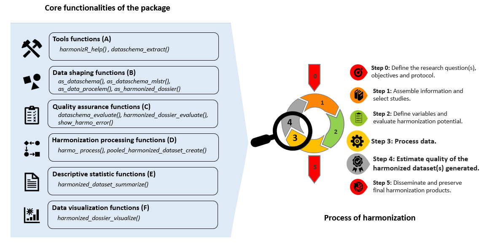

```{r, include = FALSE}
knitr::opts_chunk$set(
  collapse = TRUE,
  comment = "#>",
  echo = T,
  results = "hide")

```


# Overview

In a typical harmonization process, ‘Rmonize’ functions use a few main inputs: 
input datasets, input data dictionaries, the DataSchema, and 
the Data Processing Elements. These inputs are generally created in other 
programs, imported into R, and prepared as needed to match the specific formats 
required by **Rmonize** functions.

 * **Input datasets** contain variables in original formats (e.g., as 
collected by separate studies, cohorts or any research program), which provide 
the source variables for harmonization processing. Ideally, 
input **data dictionaries** that contain metadata about variables (e.g., labels, 
units, categories) are also provided by the user and associated with the 
datasets but are not required.
 * The **DataSchema** defines the list and attributes of harmonized variables to be 
generated (guidelines Step 2). 
 * **The Data Processing Elements** contain the 
processing rules and metadata that will be used to generate harmonized variables 
from input variables (guidelines Step 3). 

These inputs provide the information used to evaluate and document the 
harmonization process and harmonized datasets produced (Steps 4 and 5). 
The DataSchema and Data Processing Elements are first created in spreadsheets 
(typically from Excel templates) and imported into R. 
*These elements are mandatory in the technical process of harmonization in this package.*


# How does the harmonization process work ?

::: {class="image-container-big"}
  
:::

To function properly, the harmonization process requires a clear mapping or 
association between the input variables in the input dataset and the 
harmonized variables to be generated in the output harmonized dataset. 
This mapping is typically defined using the Data Processing Elements (DPE) and 
the DataSchema.

The DataSchema, provides a structured description of the target harmonized 
variables to be generated. It includes information such as variable names, 
data types, and any other relevant metadata needed for the harmonization 
process.

The DPE specifies the processing rules (e.g., transformations, combinations, 
conditional processing) necessary to derive the harmonized variables from the 
input variables.

Input datasets are first imported into R and must exist in the 
environment as data frames (or data frame extensions, e.g., tibbles). Then 
by using using the DPE in conjunction with the DataSchema, the harmonization 
process can accurately extract, process, and create harmonized variables in 
the output datasets based on the variables found in the input datasets. 
This ensures that the harmonization is done correctly and consistently across 
different datasets from various and heterogeneous origins.

For each input dataset provided, the harmonization 
process generates a corresponding output harmonized dataset in a 
harmonized dossier. The structure of each harmonized dataset is standardized, 
all with the same variables (names, valueType), as specified in the DataSchema, 
with the addition of harmonization metadata (e.g., harmonization status and 
harmonization details specified by the user).

The standardized documentation and functions for description and assessment of 
harmonized data facilitate further use by researchers for analyses and 
comparisons.

[See how to fill the Data Processing Elements](c-The-Data-processing-elements.html)


