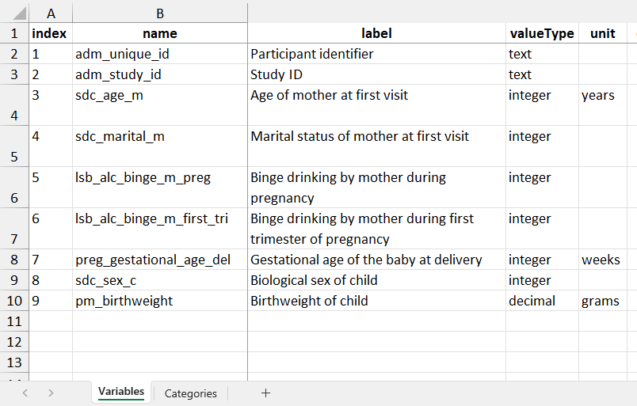
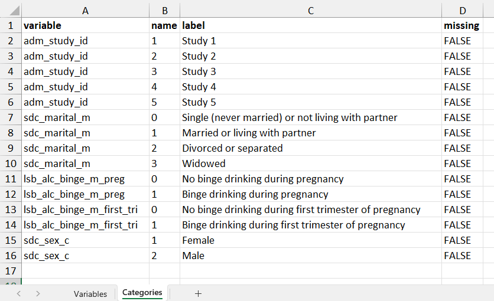
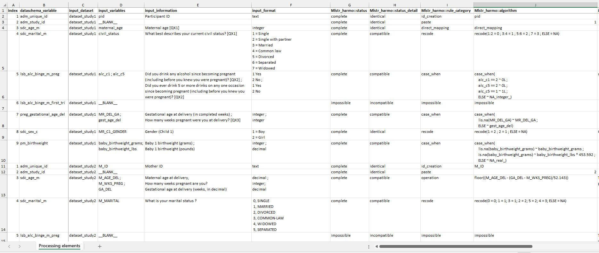

```{r, include = FALSE}
knitr::opts_chunk$set(
  collapse = TRUE,
  comment = "#>"
)
```

Once you've installed your working environment, you can start processing data with Rmonize. This vignette provides a simple walk-through with error-free example input elements. You will run through the main processing steps, from preparing inputs to generating and securing harmonized outputs.

## Load packages

Each time you start a new session in R, you must load the packages you want to use. In addition to Rmonize, you should load any packages you want to use for data processing in your R session in general or in specific harmonization algorithms. In our example, we load tidyverse, which includes packages and functions we frequently use.

```{r eval=FALSE}
# Load relevant packages
library(Rmonize)
library(tidyverse) # Collection of R packages for data science
```

> **TIP:** You must install and load any packages whose functions are used in individual algorithms in the Data Processing Elements (see below), otherwise an error will be generated when processing data with `harmo_process()`.

In this vignette, we will use error-free examples included with the package, which are based on a use case representing a harmonization initiative with synthetic datasets from five studies to be harmonized.

```{r eval=FALSE}
# See available examples
names(Rmonize_examples)
```

## Prepare the input elements

Processing data using Rmonize depends on three user-provided input elements: the input datasets, the DataSchema, and the Data Processing Elements.

### Input datasets

The input datasets are the data tables containing the collections of variables provided by participating studies or initiatives to use in processing. (Input data dictionaries with metadata about the variables in input datasets can also be provided, but these are optional for processing and are not discussed in this vignette.)

```{r eval=FALSE}
# Get the input datasets
dataset_study1 <- Rmonize_examples$input_dataset_study1
dataset_study2 <- Rmonize_examples$input_dataset_study2
dataset_study3 <- Rmonize_examples$input_dataset_study3
dataset_study4 <- Rmonize_examples$input_dataset_study4
dataset_study5 <- Rmonize_examples$input_dataset_study5
```

Processing can be done on one input dataset or multiple datasets at a time. Multiple input datasets (and any associated data dictionaries) must be grouped into a named list (which we call a dossier). A single dataset can be provided as a data frame or as a dossier.

```{r eval=FALSE}
# Group multiple datasets into a dossier.
# IMPORTANT: The names of the datasets in the dossier must match the column
# input_dataset in the Data Processing Elements.
# These will also be used in documentation of the harmonization outputs.

input_dossier <- dossier_create(list(
  dataset_study1,
  dataset_study2,
  dataset_study3,
  dataset_study4,
  dataset_study5))
```

### DataSchema

The DataSchema defines the core variables to generate across datasets. For use in Rmonize, a DataSchema document is generally prepared from an Excel template minimally including information about the variable names, labels, data types, and (if any) categories. The Excel file is then imported into R as an R object, which is a list of data frames (see online documentation). Additional columns can also be provided for documentation, as seen in the example DataSchema.

```{r eval=FALSE}
# Get a DataSchema
dataschema <- Rmonize_examples$DataSchema
```

```{r, fig.cap="Subsets of the example DataSchema document, showing the Variables", out.width="80%", fig.align="center",echo=FALSE}

```

```{r, fig.cap="Subsets of the example DataSchema document, showing the Categories", out.width="80%", fig.align="center",echo=FALSE}

```

### Data Processing Elements

The Data Processing Elements (DPE) defines the input elements and, where applicable, the algorithms to generate harmonized variables in DataSchema formats. It documents the possibility (or not) to generate each DataSchema variable in each dataset, the specific processing steps, and any additional user-defined documentation. The DPE is also typically prepared from an Excel template (see the documentation on preparing the Data Processing Elements) and has one row per DataSchema variable per input dataset. The example DPE in the package can be used to process all five input datasets at the same time, or you can prepare a DPE for a single input dataset and run processing for one dataset at a time.

```{r eval=FALSE}
# Get the Data Processing Elements
dpe <- Rmonize_examples$`Data_Processing_Element_no errors`

# Get the Data Processing Elements for a single dataset (study1)
dpe_study1 <- dpe %>%
  filter(input_dataset == "dataset_study1")
```

```{r,fig.cap="Subset of the example Data Processing Elements document.", out.width="100%", fig.align="center",echo=FALSE}

```

## Process the inputs into harmonized outputs

You can use the prepared inputs to generate harmonized data with `harmo_process()`. The function can be run with one or more input datasets, but the DPE must include instructions for each DataSchema variable in each input dataset. The same DataSchema is used regardless of the number of input datasets.

```{r eval=FALSE}
# Run processing function on all five datasets
harmonized_dossier <- harmo_process(
  object = input_dossier,
  dataschema = dataschema,
  data_proc_elem = dpe,
  harmonized_col_dataset = 'adm_study_id') # Identifies the harmonized variable to use as dataset identifiers

# Run processing function on a single dataset
harmonized_dossier_study1 <- harmo_process(
  object = dataset_study1,
  dataschema = dataschema,
  data_proc_elem = dpe_study1,
  harmonized_col_dataset = 'adm_study_id') # Identifies the harmonized variable to use as dataset identifiers
```

The processing produces a harmonized dossier, a list of harmonized datasets (one for each input dataset) and associated metadata, along with information automatically extracted from the DataSchema and DPE. In this vignette, there are no processing errors, but any errors or warnings would be printed in the console. (For an example of processing with errors, see the vignette Process inputs into harmonized outputs.)

> **TIP:** The dataset name(s) in the input dossier or 'object' parameter must match the dataset name(s) declared in the input_dataset column in the DPE.

## Summarize and secure harmonized outputs

You can summarize harmonized dossiers with summary statistics and visual reports.

```{r eval=FALSE}
# Produce a summary report of the harmonized datasets and variables
summary_report_harmonized_dossier <- 
  harmonized_dossier_summarize(harmonized_dossier)

# Produce a visual report of the harmonized datasets and variables
# You must specify a folder to contain the visual report files, and the folder name must not already exist.
# WARNING: This script creates a folder 'tmp'.
bookdown_path <- paste0('tmp/',basename(tempdir()))
if(dir.exists(bookdown_path)) file.remove(bookdown_path)

harmonized_dossier_visualize(
  harmonized_dossier,
  bookdown_path = bookdown_path,
  harmonized_dossier_summary = summary_report_harmonized_dossier
    )

# Open the visual report in a browser.
bookdown_open(bookdown_path)
```

If there are multiple datasets in the harmonized dossier, you can combine them into one pooled harmonized dataset.

```{r eval=FALSE}
# Generate one pooled harmonized dataset from a harmonized dossier
pooled_harmonized_dataset <- pooled_harmonized_dataset_create(
  harmonized_dossier = harmonized_dossier)
```

> **TIP:** The parameter 'harmonized_col_dataset' can be used to indicate the variable that identifies each dataset, if such a variable is available (e.g., in this example, the values in the column adm_study_id identify each dataset). If 'harmonized_col_dataset' is empty, a new column will be created in the pooled dataset using the dataset names from the harmonized dossier as values, and a warning will be printed in the console. This is to ensure that source datasets are indicated if needed in further data analysis, and that participants (each row of the pooled dataset) can always be uniquely identified in case there is any overlap in IDs. It is good practice to include a categorical variable in the DataSchema that identifies the dataset.

You can get the harmonized data dictionaries for each dataset from the harmonized dossier.

```{r eval=FALSE}
# Extract the data dictionary for one dataset
data_dictionary_study1 <- data_dict_extract(harmonized_dossier$dataset_study1)
```

The summaries and visual reports can be used to validate the harmonization process, identify and correct any remaining issues, update the inputs, and rerun processing as needed. Once you are satisfied with the outputs, they can be saved in various formats. For example, harmonized datasets can be exported as labelled datasets that keep variable attributes as metadata, and summary reports can be saved as Excel files.

```{r eval=FALSE}

# WARNING: This script creates a folder 'tmp'.
output_path <- paste0('tmp/',basename(tempdir()))
dir.create(output_path)

# Save the harmonized dossier as an R file to preserve all metadata
saveRDS(harmonized_dossier, paste0(output_path,"/my_dossier.rds"))

# Export a harmonized dataset to another file format
library(haven)
write_sav(harmonized_dossier$dataset_study1, paste0(output_path,"/my_spss_file.sav"))

# Export a summary as an Excel file
library(fabR)
write_excel_allsheets(
  summary_report_harmonized_dossier, paste0(output_path,"/my_summary_report.xlsx"))
```

## Next steps

In this vignette, we used inputs that already have valid structure and content. In reality, you may need to explore your input datasets in more depth, get help preparing the Data Processing Elements, troubleshoot process errors, or better understand the harmonized outputs. For more in-depth exploration of specific steps, other vignettes and documentation are available:

-   Explore and prepare input datasets and data dictionaries
-   Prepare the Data Processing Elements document
-   Process inputs into harmonized outputs
-   Summarize and secure harmonized outputs
