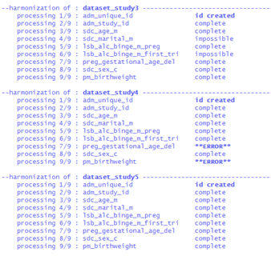
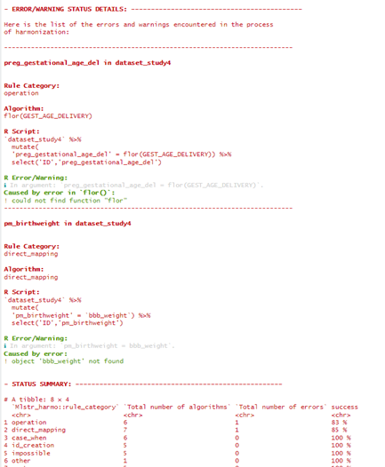
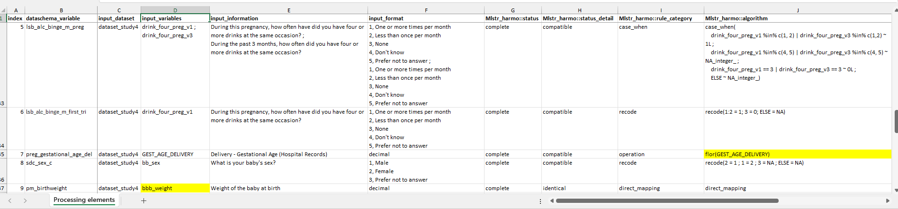

```{r, include = FALSE}
knitr::opts_chunk$set(
  collapse = TRUE,
  comment = "#>"
)
```

In the vignette Simple example of data processing with Rmonize, we ran through an example with no processing errors. In reality, you might encounter processing errors and need to troubleshoot the process and/or inputs. This vignette focuses on running the main processing function which uses the prepared input elements to produce harmonized datasets and identifying and correcting errors in the Data Processing Elements (DPE).

## Load packages

```{r eval=FALSE}
# Load relevant packages
library(Rmonize)
library(tidyverse) # Collection of R packages for data science
```

> **TIP:** You must install and load any packages whose functions are used in individual algorithms in the Data Processing Elements (see below), otherwise an error will be generated when processing data with `harmo_process()`.

## Read input elements

The input elements needed for processing are the input datasets, DataSchema, and DPEs, which are available from the examples included in the package. This example uses cleaned input datasets and a DataSchema that has no errors. We will start with a version of the DPE that has the correct structure and required columns (see [online documentation](https://maelstrom-research.github.io/Rmonize-documentation/articles/a-Glossary-and-templates.html)), but has some issues that will create errors in processing.

```{r eval=FALSE}
# Get the input datasets
dataset_study1 <- Rmonize_examples$input_dataset_study1
dataset_study2 <- Rmonize_examples$input_dataset_study2
dataset_study3 <- Rmonize_examples$input_dataset_study3
dataset_study4 <- Rmonize_examples$input_dataset_study4
dataset_study5 <- Rmonize_examples$input_dataset_study5

# Get the DataSchema
dataschema <- Rmonize_examples$DataSchema

# Get the Data Processing Elements
dpe_with_errors <- Rmonize_examples$`Data_Processing_Element_with errors`
# This version contains some examples of potential processing errors.
```

In the examples, the DPE contains processing instructions for all five datasets, but you can prepare separate DPE documents for each input dataset as well.

## Process data

If more than one input dataset is being processed at the same time, they are provided as a named list of data frames (which we refer to as a 'dossier') with names matching the input_dataset values specified in the DPE. The dataschema_variable values in the DPE must also match the DataSchema provided. The output of `harmo_process()` is a 'harmonized dossier', a list of harmonized dataset(s) with the same name(s) as the input dataset(s), with specific attributes/metadata.

If there are basic issues with any of the input elements (e.g., elements have incorrect structure or are missing required columns), the process will stop and print a message about the issue. If there are errors in running individual algorithms, as in this example, the overall process will run, but a message will be printed about 'error' statuses being present.

```{r eval=FALSE}
# Create an input dossier
input_dossier <- dossier_create(list(
  dataset_study1,
  dataset_study2,
  dataset_study3,
  dataset_study4,
  dataset_study5))

# Run processing function
harmonized_dossier_with_errors <- harmo_process(
  object = input_dossier,
  dataschema = dataschema,
  data_proc_elem = dpe_with_errors,
  harmonized_col_dataset = 'adm_study_id') # Identifies the harmonized variable to use as dataset identifiers
```

```{r,fig.cap="Subset of processing information printed in the console, including messages about errors in running individual algorithms.", out.width="80%", fig.align="center",echo=FALSE}

```


> **TIP:** The function `harmo_process()` can be run on one study at a time (datasets and DPEs) or subsets of the variables (DataSchema and DPEs) to help isolate issues.

> **TIP:** The dataset names in the list in the input_dossier must match the input_dataset in the DPE.

## Check for and correct errors in the DPE

Typically, any processing errors at this stage come from errors in the DPEs (e.g., incorrectly written algorithms or misspecified input variables). If there are any processing errors, the associated harmonized dataset created is empty (no harmonized variable values) but has attributes from the input elements, which can be used to identify errors. Individual errors are printed in the console during processing and can also be extracted with `show_harmo_error()`.

```{r eval=FALSE}
# To identify processing errors to correct in the DPE
show_harmo_error(
  harmonized_dossier_with_errors,
  show_warnings = TRUE) # Can be informative, but can also be turned off, e.g., if there are known warnings produced by processing algorithms
```

This prints the specific DataSchema variables and input datasets affected by the errors and information about the specific error.

```{r,fig.cap="Subset of output from show_harmo_error() printed in the console.", out.width="80%", fig.align="center",echo=FALSE}

```

In this example, there are errors in generating the DataSchema variables preg_gestational_age_del and pm_birthweight in dataset_study4. These variables have the specific errors 'could not find function "flor"' and 'object 'bbb_weight' not found', respectively. In this case, inspecting the error messages and associated rows in the DPE indicate that the errors come from typos. The function 'flor' used in the algorithm for preg_gestational_age_del in dataset_study4 should instead be 'floor', and the input_variable 'bbb_weight' used for pm_birthweight in dataset_study4 should instead be 'bb_weight'.

You can use these error messages to make necessary corrections in the DPE Excel file and import the updated version of the DPE without errors (this approach is usually simpler and clearer for documenting versions of the DPE than making changes to the DPE in R).

```{r,fig.cap="Example of locating the errors in the DPE document.", out.width="80%", fig.align="center",echo=FALSE}

```

The processing is then rerun with the updated DPE and checked for processing errors as many times as needed.

```{r eval=FALSE}
# Get corrected DPEs with changes made based on error messages
dpe_no_errors <- 
  Rmonize_examples$`Data_Processing_Element_no errors` %>%
  as_data_proc_elem()

# Run processing function
harmonized_dossier <- harmo_process(
  object = input_dossier,
  dataschema = dataschema,
  data_proc_elem = dpe_no_errors,
  harmonized_col_dataset = 'adm_study_id' # Identifies the harmonized variable to use as dataset identifiers
)

# Confirm there are no errors
show_harmo_error(
  harmonized_dossier,
  show_warnings = TRUE
)
```

Typos are common sources of errors in the DPE, as are mis-specifications in algorithms. Filling out the DPE can take some time and attention to detail, but has benefits in comprehensively documenting the processing done, providing a clear way to communicate with others about the processing, and making it easier to identify issues and make revisions to the processing. [See further documentation](https://maelstrom-research.github.io/Rmonize-documentation/articles/b-Data-processing-elements.html) for more details about the DPE.

Once there are no processing errors, the harmonized dossier can be used to extract harmonization outputs (see the vignette Summarize and secure harmonized outputs).

## Save the harmonized dossier

> **TIP:** The harmonized dossier should be saved as an R file so that the structure and all metadata is preserved and it can be easily used in other Rmonize functions.

```{r eval=FALSE}
# Save the harmonized dossier as R file
# WARNING: This script creates a folder 'tmp'.
output_path <- paste0('tmp/',basename(tempdir()))
dir.create(output_path)
saveRDS(harmonized_dossier, paste0(output_path,"/harmonized_dossier.rds"))
```

