```{r, include = FALSE}
knitr::opts_chunk$set(
  collapse = TRUE,
  eval = FALSE,
  comment = "#>",
  warning = FALSE,
  message = FALSE,
  echo = TRUE)

```


```{r, eval = TRUE, echo = FALSE}
source('datatables.R')

```

# How to fill the Data Processing Elements ?

1. Open the Data Processing Elements template, or an empty one.

**For each variable to harmonize:**

2. Enter DataSchema information: 
    * Name of the variable to harmonize
    
3. Enter the input dataset information : 
    * Name of the dataset 
    * Name of the variable(s)
    
4. Enter the data processing information in the Data Processing Elements :
    * Rule category
    * Algorithm
    * Harmonization status (not mandatory)

# Initialization of the harmonization with the DataSchema variable adm_unique_id (mandatory)


**1 Open the DataSchema to understand the variable to generate.**

:::: {class="flex-container"}

::: {class="image-container-big"}
  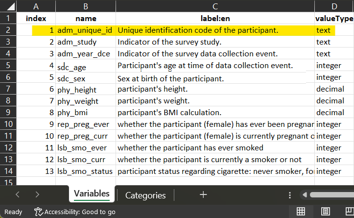
:::
 
::: {class="text-container-small"}
  <br>
  **The definition of the variable is in the DataSchema**. *The name and the valueType 
  of the variable will be reported in the Data Processing Elements.*
:::
 
::::

<br>

**2 Collect in each dataset the column corresponding to the participant identifier.**

:::: {class="flex-container"}

::: {class="image-container-even"}

  <p>**id** in dataset_MELBOURNE_1</p>
  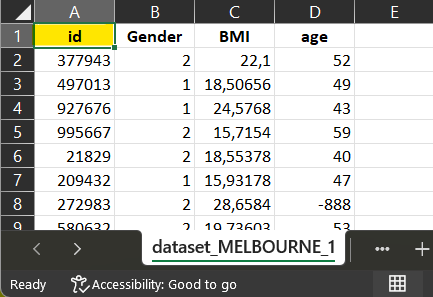
:::
 
::: {class="image-container-even"}
  <p>**id** in dataset_MELBOURNE_2</p>
  
:::
 
::::

:::: {class="flex-container"}

::: {class="image-container-even"}

  <p>**ID** in dataset_PARIS</p>
  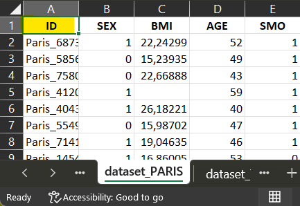
:::
 
::: {class="image-container-even"}
  <p>**part_id** in dataset_TOKYO</p>
  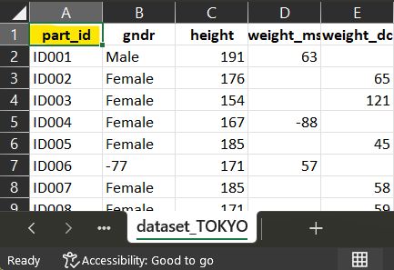
:::
 
::::

<br>

**3 Open the Data Processing Elements and fill for each dataset the information accordingly**

::: {}
  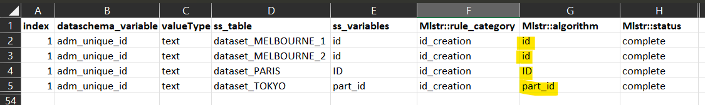
    
  <p>*The names in 'input_dataset' must be the same in the dossier and in the Data Processing Elements*</p>
:::

<br>
    
# Harmonization of the DataSchema variable sdc_sex

**1 Open the DataSchema to understand the variable to generate.**

:::: {class="flex-container"}

::: {class="image-container-big"}
  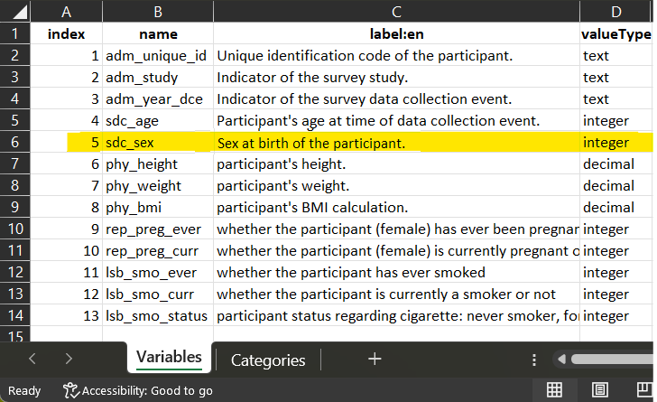
  
  <br>
  
  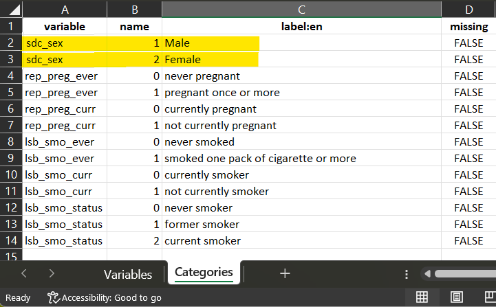
:::
 
::: {class="text-container-small"}

  <br><br><br>
  **The definition of the variable is in the DataSchema.** The name and the valueType 
  of the variable will be reported in the Data Processing Elements. When categorical,
  Each input variable (when possible) will be recoded to match the DataSchema
  variables categories, using rules of harmonization.
  
  *For each dataset, use the data dictionary to comprehend codification and start 
  elaborating the script of harmonization.*

:::
 
::::

<br>

**2 Identify for each dataset which column (variable) will be associated to the
harmonization script to generate the harmonized variable.**

### dataset_MELBOURNE_1

:::: {class="flex-container"}

::: {class="image-container-big"}
  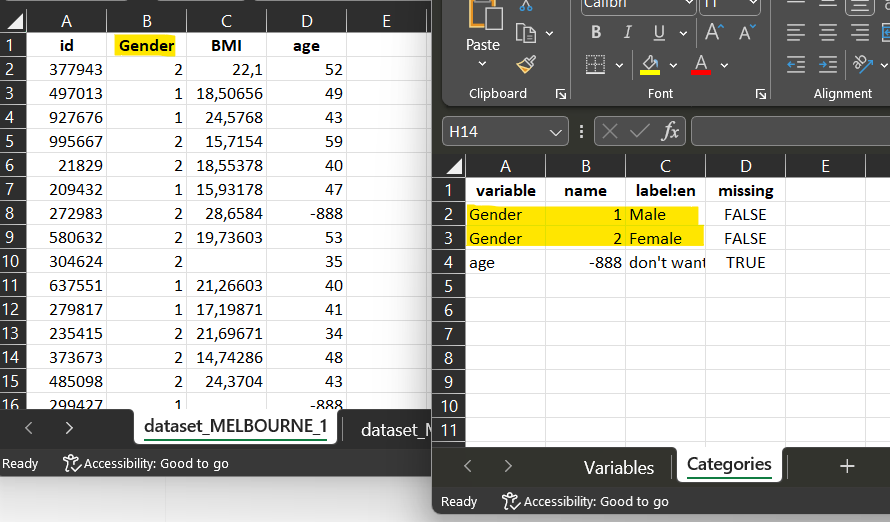
:::
 
::: {class="text-container-small"}

  <br><br>
  For dataset_MELBOURNE_1, the corresponding variable 'Gender' share the same codification
  with the DataSchema variable. The script is a **direct_mapping**.

:::
 
::::


::: {}
    
  <p>***Start filling the Data Processing Elements for each of the dataset, 
  one DataSchema variable after the other.***</p>
  
  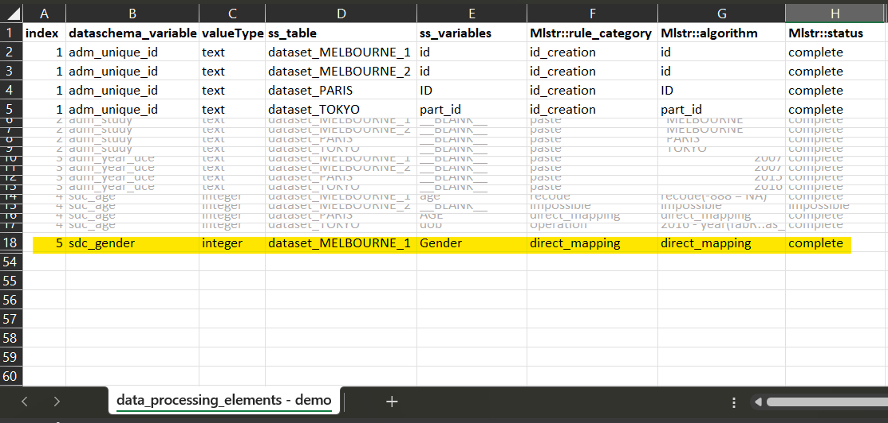
:::

<br>

### dataset_MELBOURNE_2

:::: {class="flex-container"}

::: {class="image-container-big"}
  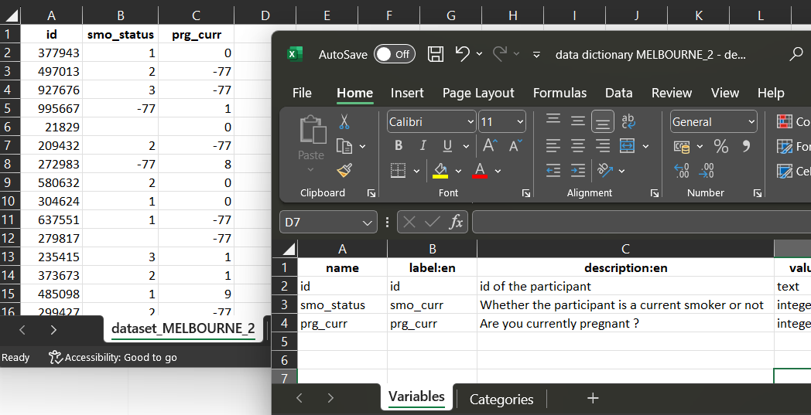
:::
 
::: {class="text-container-small"}

  <br><br>
  For dataset_MELBOURNE_2, There is no corresponding variable collected. 
  The harmonization is **impossible**.

:::
 
::::


::: {}
    
  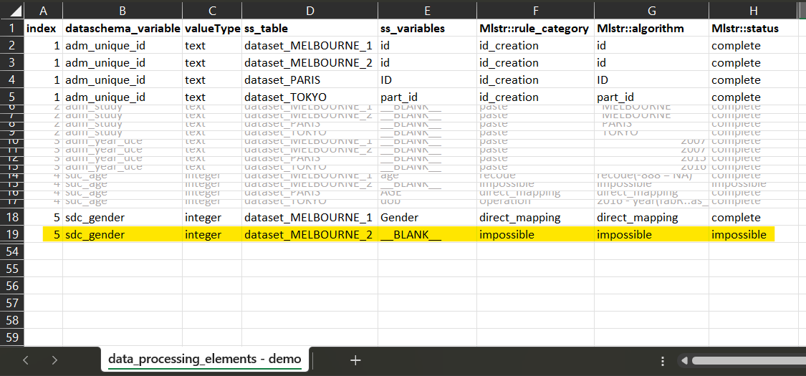
:::

<br>

### dataset_PARIS

:::: {class="flex-container"}

::: {class="image-container-big"}
  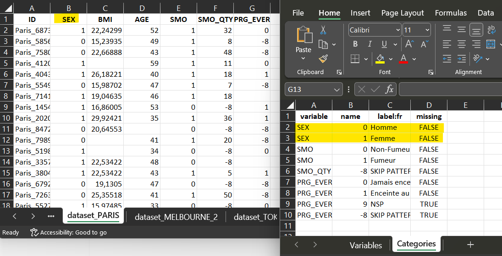
:::
 
::: {class="text-container-small"}

  <br><br>
  For dataset_PARIS, the corresponding variable 'SEX' has a codification which is
  compatible with the DataSchema variable codification. The script is a **recode**, where 
  each '0' will be recoded into '1' and each '1' into '2'.

:::
 
::::


::: {}
    
  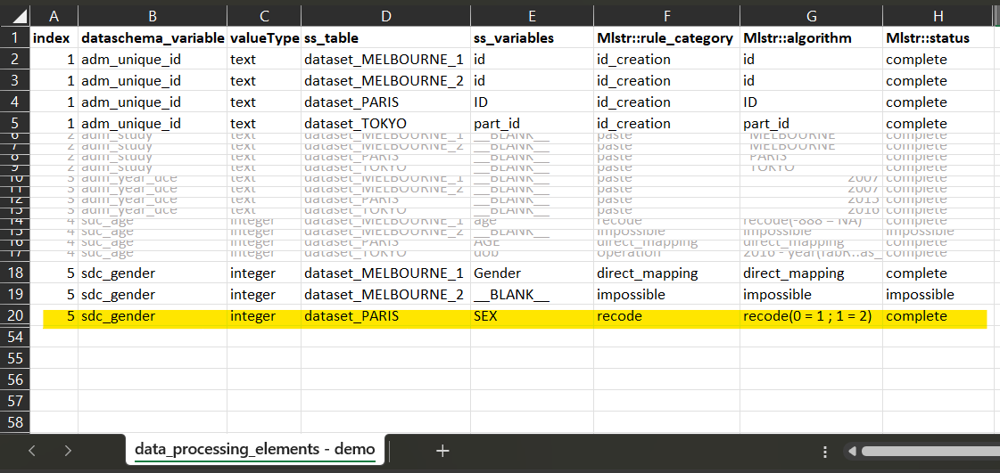
:::

<br>

### dataset_TOKYO

:::: {class="flex-container"}

::: {class="image-container-big"}
  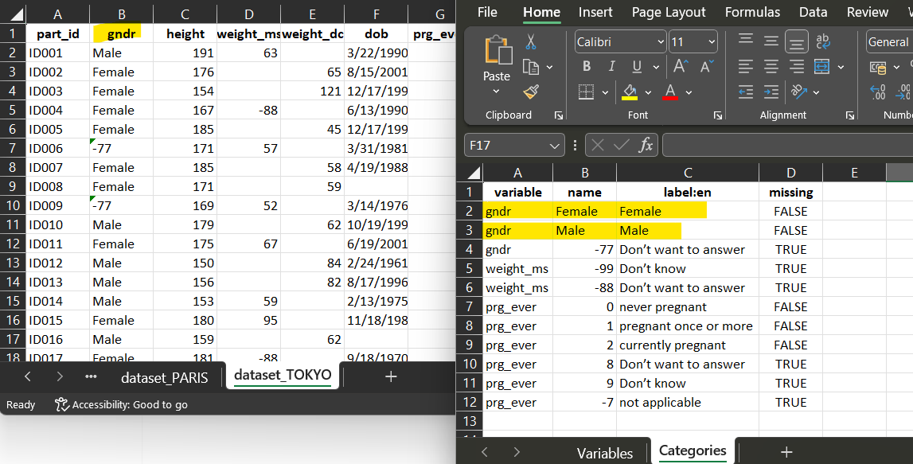
:::
 
::: {class="text-container-small"}

  <br><br>
  For dataset_TOKYO, the corresponding variable 'gndr', the script is also a **recode**, 
  where each 'Male' will be recoded into '1' and each 'Female' into '2'.

:::
 
::::


::: {}
    
  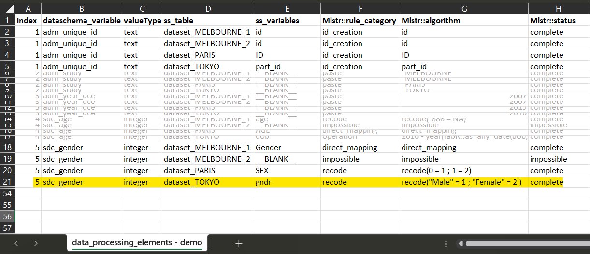
:::

<br><br><br>

**3 Fill the Data Processing Elements.**

Process similarily for each DataSchema variable. When further investigation or 
future information to be completed, put <b>undetermined</b> as a placeholder.

::: {}
    
  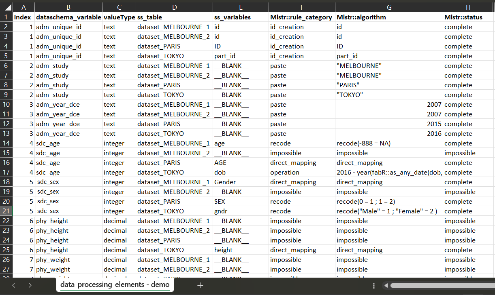
:::

<br>

Save your work, close file and upload it in your R environment if necessary.


**Warning ⚠** In your environment, additional objects must exist:
 * The dossier containing your input dataset(s)
 * The DataSchema. If not, a minimum DataSchema will be created from elements 
found in the Data Processing Elements.

```{r}

dataset_MELBOURNE_1 <- DEMO_files_harmo$dataset_MELBOURNE_1
dataset_MELBOURNE_2 <- DEMO_files_harmo$dataset_MELBOURNE_2
dataset_PARIS <- DEMO_files_harmo$dataset_PARIS
dataset_TOKYO <- DEMO_files_harmo$dataset_TOKYO

# create the dossier
dossier <- dossier_create(list(
  dataset_MELBOURNE_1, dataset_MELBOURNE_2, dataset_PARIS, dataset_TOKYO))

dataschema <- DEMO_files_harmo$`dataschema - final`
data_proc_elem <- DEMO_files_harmo$`data_processing_elements - final`

# perform harmonization
harmo_process(dossier,dataschema,data_proc_elem)
    
```

[See the whole data processing through a DEMO](d-Example-with-DEMO-files.html)


## Understanding the output : how to detect and correct errors.

If the data processing produces errors in R, the process will not generate
the harmonized datasets affected, to avoid version conflicts. The error will be stored in
a the column 'Mlstr_harmo::status' in its harmonized data dictionary. The error can be read
directly in the console using the function [show_harmo_error()](../reference/show_harmo_error.html)

```{r}

data_proc_elem <- 
  DEMO_files_harmo$`data_processing_elements - with error`

# perform harmonization
harmonized_dossier <- harmo_process(dossier, dataschema, data_proc_elem)

# use the function to help correcting elements of the harmonization;
show_harmo_error(harmonized_dossier)
    
```

:::: {class="flex-container"}

::: {class="image-container-big"}
  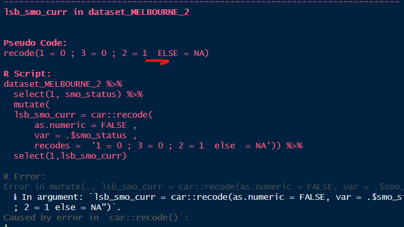
:::
 
::: {class="text-container-small"}
  <br>
  ***Example*** *: in the Data Processing Elements, a semi-colon is missing in the
  script. The error generated can be visually assessed in the console so the user
  can make corrections.*
:::
 
::::


**Warning ⚠** Sometimes, the harmonization produces warnings which are to consider 
and evaluate very closely, because they may refer to errors. A common warning generated
is when a decimal is converted into an integer. R does not analyses it as an error,
but the information is wrongly harmonized in that case. You should always use 
[harmonized_dossier_evaluate()](../reference/harmonized_dossier_evaluate.html), 
[harmonized_dossier_summary()](../reference/harmonized_dossier_summary.html) and 
[harmonized_dossier_visualize()](../reference/harmonized_dossier_visualize.html) 
to help in the the assessment of harmonization. 


