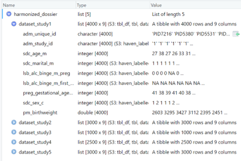
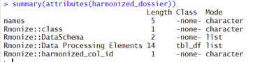
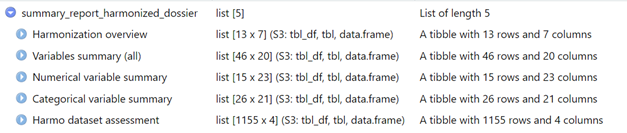
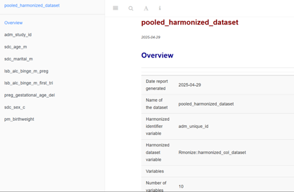
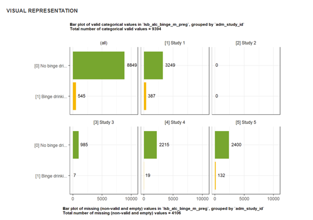

```{r, include = FALSE}
knitr::opts_chunk$set(
  collapse = TRUE,
  comment = "#>"
)
```

Once you have processed inputs and generated harmonized outputs, you can examine the harmonized datasets and extract different outputs. This vignette shows you how to access and use harmonized outputs from the harmonized dossier.

## Load packages

```{r eval=FALSE}
# Load relevant packages
library(Rmonize)
library(fabR) # Additional functions to help with importing data
library(tidyverse) # Collection of R packages for data science
```

## Get the harmonized dossier

The harmonized dossier produced by `harmo_process()` is a list containing the harmonized datasets and associated metadata (including the DataSchema, DPEs, and harmonized data dictionaries), which can be further examined and summarized. We will use a harmonized dossier that is provided with the examples in the packages, which includes harmonized outputs from five study datasets (and is the equivalent of the harmonized dossier generated in the vignette Process inputs and generate harmonized outputs).

```{r eval=FALSE}
# Load harmonized dossier
harmonized_dossier <- Rmonize_examples$harmonized_dossier

# See information about the harmonized dossier in the RStudio viewer
View(harmonized_dossier)

# See additional attributes associated with the harmonized dossier
summary(attributes(harmonized_dossier))
```

```{r,fig.cap="Information about the example harmonized dossier provided in the RStudio viewer.", out.width="80%", fig.align="center",echo=FALSE}

```

```{r,fig.cap="Additional Rmonize attributes are also associated with the harmonized dossier.", out.width="80%", fig.align="center",echo=FALSE}

```


## Summarize harmonized datasets

You can get more detailed summaries and descriptive statistics about the harmonized datasets and variables. By default, summaries of a harmonized dossier are generated for pooled data and grouped by dataset. The output of dataset summaries can easily be exported as Excel files.

```{r eval=FALSE}
# Produce dataset and variable summaries
summary_report_harmonized_dossier <- 
  harmonized_dossier_summarize(harmonized_dossier)
# Note: This report is also provided in Rmonize_examples$summary_report_harmonized_dossier.

# Export to Excel
# WARNING: This script creates a folder 'tmp'.
output_path <- paste0('tmp/',basename(tempdir()))
dir.create(output_path)
write_excel_allsheets(
  summary_report_harmonized_dossier,
  paste0(output_path,"/summary_report_harmonized_dossier.xlsx"))
```


```{r,fig.cap="Information about the example harmonized dossier summary report provided in the RStudio viewer.", out.width="80%", fig.align="center",echo=FALSE}

```


You can get visual summaries of the harmonized datasets and variables, which by default are produced for the pooled data and grouped by dataset. A categorical variable 'Rmonize::harmonized_col_dataset' is created based on the dataset names and included in the report.

```{r eval=FALSE}
# Produce a visual report of the harmonized datasets and variables
# You must specify a folder to contain the visual report files, and the folder name must not already exist.
# WARNING: This script creates a folder 'tmp'.
bookdown_path <- paste0('tmp/',basename(tempdir()))
if(dir.exists(bookdown_path)) file.remove(bookdown_path)

harmonized_dossier_visualize(
  harmonized_dossier,
  bookdown_path = bookdown_path,
  harmonized_dossier_summary = summary_report_harmonized_dossier
  )

# Open the visual report in a browser.
bookdown_open(bookdown_path)
```

To open the visual report outside of R, go to the folder containing the bookdown files, open the folder 'docs', and open the file 'index'.

*Screenshots from the interactive html visual report of the harmonized dossier:*

```{r, fig.cap="a) the Overview page", out.width="80%", fig.align="center",echo=FALSE}

```

```{r, fig.cap="b) summary figure for the variable lsb_alc_binge_m_preg.", out.width="80%", fig.align="center",echo=FALSE}

```

While there should be no technical data processing errors at this point, the harmonized datasets should always be validated. Data summaries and visual reports can help further verify that there were no remaining issues in data processing or data content. You can also use the reports to compare distributions for the pooled dataset and individual datasets.

## Extract harmonized data dictionary

A harmonized data dictionary with useful metadata about the datasets and variables can be extracted from the harmonized dossier.

```{r eval=FALSE}
# Extract the data dictionary
data_dict_harmonized_dossier <- 
  harmonized_dossier %>%
  lapply(data_dict_extract)
```

> **INFO:** The function `data_dict_extract()` will create a data dictionary from metadata associated with any dataset. From a harmonized dataset generated from `harmo_process()`, the data dictionary will include all fields from the DataSchema, certain fields from the DPE, and the R script used to generate the variable for each dataset.

## Create pooled harmonized dataset

The harmonized dossier contains individual harmonized datasets as named data frames contained in a list. They can be explicitly combined into a pooled harmonized dataset, which includes much of the associated metadata.

```{r eval=FALSE}
# Generate one pooled harmonized dataset from a harmonized dossier
pooled_harmonized_dataset <- 
  pooled_harmonized_dataset_create(
  harmonized_dossier = harmonized_dossier)
```

> **TIP:** The parameter 'harmonized_col_dataset' can be used to indicate the variable that identifies each dataset, if such a variable is available (e.g., in this example, the values in the column adm_study_id identify each dataset). If 'harmonized_col_dataset' is empty, a new column will be created in the pooled dataset using the dataset names from the harmonized dossier as values, and a warning will be printed in the console. This is to ensure that source datasets are indicated if needed in further data analysis, and that participants (each row of the pooled dataset) can always be uniquely identified in case there is any overlap in IDs. It is good practice to include a categorical variable in the DataSchema that identifies the dataset.

## Export harmonized datasets to other formats

You can work with the harmonized datasets in R or export them into other data formats. Data dictionaries can be exported as Excel files.

```{r eval=FALSE}
# Export harmonized datasets without metadata to Excel
# WARNING: This script creates a folder 'tmp'.
output_path <- paste0('tmp/',basename(tempdir()))
dir.create(output_path)

for(i in names(harmonized_dossier)){
  filename <- 
      paste0(output_path,"/outputs/harmonized_datasets/harmonized_",i,".xlsx")
  write_excel_allsheets(harmonized_dossier[[i]],filename)}

# Export harmonized data dictionaries to Excel
for(i in names(data_dict_harmonized_dossier)){
  filename <-
    paste0(output_path,
           "/outputs/harmonized_data_dictionaries/harmonized_data_dictionary_",i,".xlsx")
  write_excel_allsheets(data_dict_harmonized_dossier[[i]],filename)}
```

Once harmonized outputs are produced, they can be explored with any tools and preserved in any file formats you would typically use in R.
